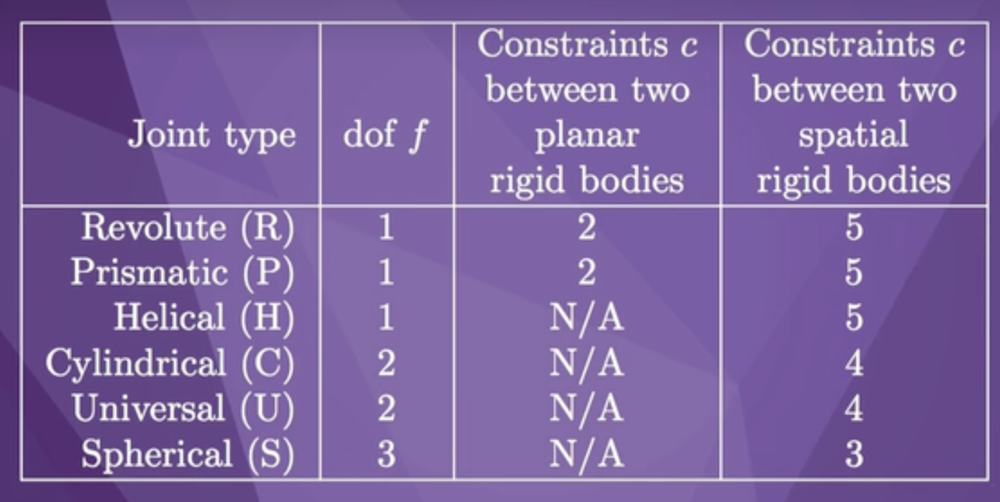
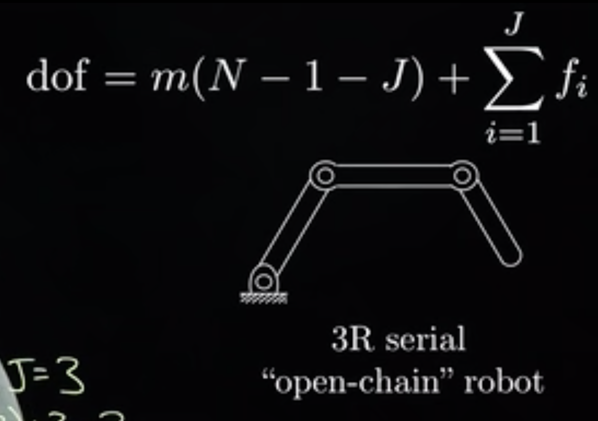
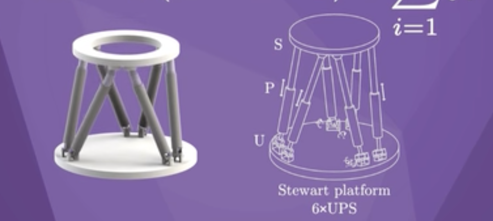
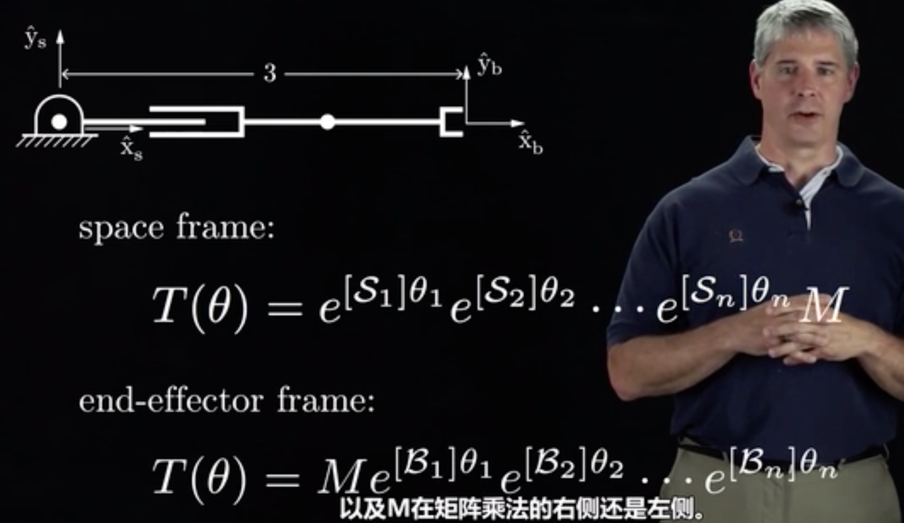

# chapter 2

## degree of freedom

M=3, N=4, J=3

dof = 3(4-1-3)+3=3

M=3, N=4, J=4

dof = 3(4-1-4)+4=1

M=6 , N=14, J=18

dof = 3(14 -1-18 )+ (3+1+2)\*6 = 6

## configuration space respresentation

### explicit parametrization

use a minimum number of coordinates to represent the space (e.g. latitude & longitude)

disvantage: longitude change faster when approaching North Pole. when pass North Pole, longitude change 180 degrees

### implicit parametrization

use a more coordinates to represent the space but more contraint

# chapter 3

## rotation matrix

P = [[1], [2], [3]], rotation matrix [[1, 0, 0], [0, 0, -1], [0, 1, 0]]
P' = R * P = [[1*1+0*2+0*3],[0*1+0*2+-1*3],[0*1+1*2+0*3]] = [[1],[-3],[2]]

## so(3) & SO(3)

SO(3) is 3x3 rotation matrices with a determinate of +1

so(3) is 3x3 skew-symmetric matrices. it represent the angular velocity followed for unit time.

exp: [ω]theta so(3) -> SO(3) (like integration)
log: SO(3) -> so(3) (like differentitation)

## Rodrigues' formula

can be used to calcuate matrix exponential when the matrix is an element of so(3) (a skew-symmetric 3x3 matrix))

e.g. Rot(ω, theta) = e^[ω]\*theta

# chapter 4

# terms

### c-space

the space of all configurations

### Grubler's formula

calculate degree of freedom

dof = m(N-1-J) + freedom of joint

N = number of link
J = number of joint

### topology

shape

## SO(3)

SO(3) refers to the special orthogonal group in three dimensions. It represents the set of all 3x3 rotation matrices that have a determinant of 1. In other words, SO(3) consists of all the matrices that represent proper rotations in three-dimensional Euclidean space.
