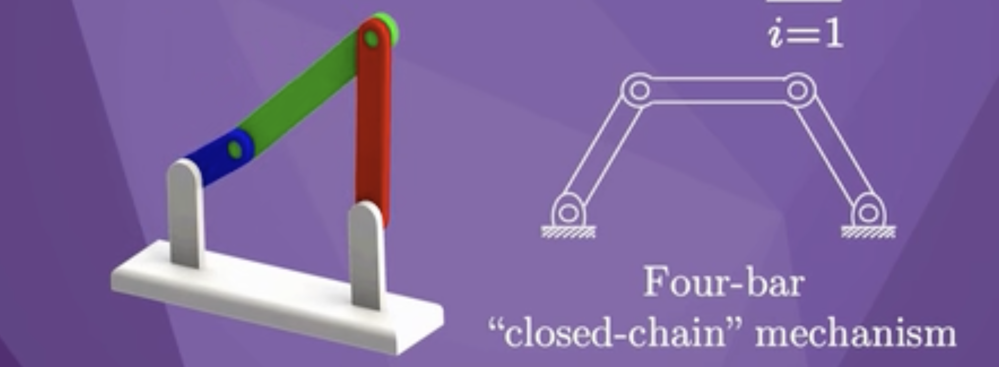

# chapter 2

## degree of freedom

M=3, N=4, J=3

dof = 3(4-1-3)+3=3

M=3, N=4, J=4

dof = 3(4-1-4)+4=1

M=6 , N=14, J=18

dof = 3(14 -1-18 )+ (3+1+2)\*6 = 6

## terms

### c-space

the space of all configurations

### Grubler's formula

calculate degree of freedom

dof = m(N-1-J) + freedom of joint

### topology

shape
