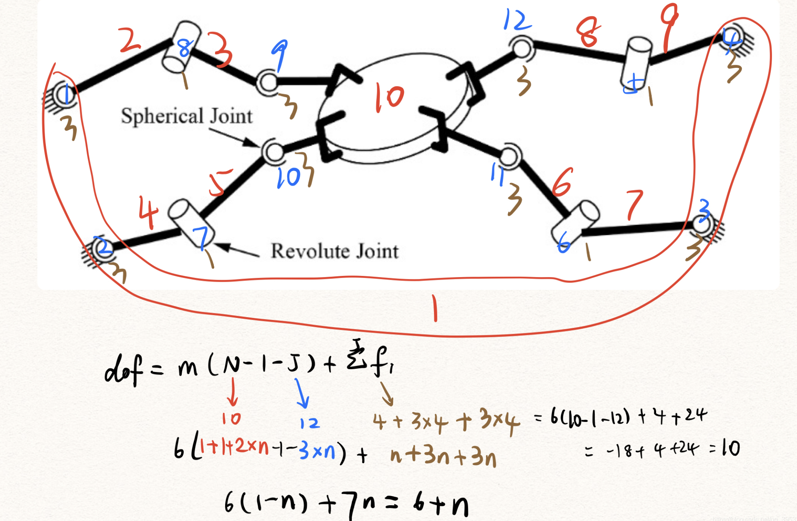

## question

Assume your arm, from your shoulder to your palm, has 7 degrees of freedom. You are carrying a tray like a waiter, and you must keep the tray horizontal to avoid spilling drinks on the tray. How many degrees of freedom does your arm have while satisfying the constraint that the tray stays horizontal? Your answer should be an integer.

## ans (chatgpt)

If your arm has 7 degrees of freedom and you are carrying a tray while keeping it horizontal, several factors come into play:

Translation: Your arm can move in three dimensions (forward/backward, left/right, up/down), which gives 3 degrees of freedom.
Rotation at the shoulder: The shoulder joint allows for two rotational degrees of freedom, typically referred to as pitch and yaw.
Rotation at the elbow: The elbow joint provides one rotational degree of freedom, usually known as flexion or extension.
Wrist rotation: The wrist joint contributes one rotational degree of freedom, often called pronation or supination.
However, when you must keep the tray horizontal, it constrains the wrist rotation to maintain the tray's level position. As a result, the wrist's rotational degree of freedom is eliminated, reducing the total degrees of freedom.

Therefore, with the constraint of keeping the tray horizontal, your arm would have 5 degrees of freedom: 3 for translation, 2 for shoulder rotation (pitch and yaw), while the wrist rotation (pronation/supination) is restricted.

## question

## question

## question

The task is to carry a waiter’s tray so that it is always horizontal (orthogonal to the gravity vector), but otherwise free to move in any other direction. How many degrees of freedom does the task space (the C-space of a horizontal tray) have? (Enter an integer number.)

## ans (chatgpt)

The task is to keep the waiter's tray horizontal (orthogonal to the gravity vector) while allowing freedom of movement in other directions. To determine the degrees of freedom of the task space, we need to consider the constraints and freedoms involved.

In this case, since the tray must remain horizontal, it eliminates the rotation about two axes (roll and pitch). Therefore, the tray can only rotate about one axis (yaw) to maintain its horizontal position. Additionally, there are three translational degrees of freedom (x, y, and z) available for the tray's movement in the remaining directions.

Hence, the task space, or C-space, of a horizontal tray has a total of 4 degrees of freedom: 1 degree for rotation (yaw) and 3 degrees for translation (x, y, and z).
