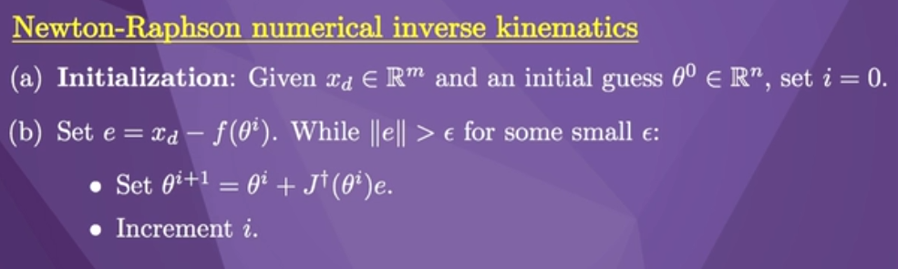

# week 1

## v_tip

is the time derivative of a minimum set of coordinates describing the end-effector's configuration

## torque

tau = J_b_T(theata) \* F_b

# week 3

## numerical inverse kinematics 
1. take advantage of geometric insight and the particular structure of the robot
2. for arbitary robot kinematics, solution may not exist

## analytic inverse kinematics
1. it requires an initial guess at the solution.

## netwon-raphson numerical inverse kinematics

